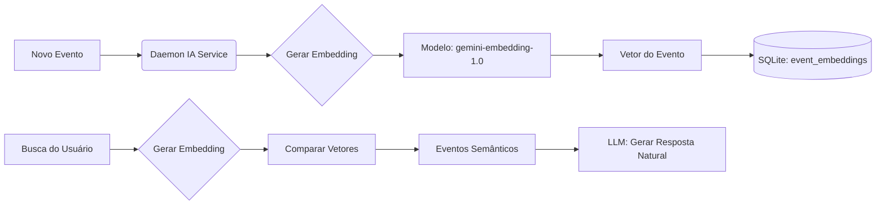

# 🚀 Memory Hub - Future Features

> Ideias de funcionalidades para expandir o Memory Hub e ajudar desenvolvedores no dia a dia.
> 
> **Criado em:** 2026-01-27  
> **Status:** Brainstorming

---

## 📊 1. Analytics & Insights Dashboard

**Descrição:** Dashboard visual com métricas e insights sobre a atividade de desenvolvimento.

**Funcionalidades:**
- Gráficos mostrando quantidade de tasks completadas, bugs corrigidos, features implementadas por dia/semana/mês
- Identificação de padrões de trabalho (horários mais produtivos, dias da semana com mais atividade)
- "Streak" de desenvolvimento: gamificação mostrando dias consecutivos de trabalho em um projeto
- Comparação entre períodos

**Complexidade:** Média  
**Prioridade:** 🥈 Média  
**Status:** [ ] Não iniciado

---

## 🔍 2. Busca Semântica com IA

**Descrição:** Usar IA para buscar eventos por significado, não apenas palavras-chave.

**Funcionalidades:**
- Perguntar em linguagem natural: *"Quando foi a última vez que trabalhei no sistema de autenticação?"*
- Encontrar eventos relacionados mesmo sem palavras-chave exatas
- Sugestões de contexto ao iniciar o trabalho: *"Ontem você parou no meio do bug X"*
- Resumos inteligentes por tema/feature

**Complexidade:** Alta  
**Prioridade:** 🥈 Média  
**Status:** [x] Concluído

#### 🧠 Conceito
Transformar o Memory Hub em um "segundo cérebro" capaz de entender o **significado** das memórias, permitindo perguntas como *"O que ficou pendente da sprint passada?"* ou encontrar eventos relacionados semanticamente (ex: "login" encontra "autenticação").

#### 🏗️ Arquitetura Técnica

**1. Embeddings (Vector Generation)**
- Cada novo evento é processado por um modelo de IA para gerar um vetor numérico.
- **Modelo Oficial:** `gemini-embedding-1.0` (Google).
- **Processo:** Texto do evento → API Gemini → Vetor Float[].

**2. Armazenamento (Vector Store)**
- Tabela dedicada no SQLite: `event_embeddings`
- Colunas: `event_id`, `vector` (blob ou JSON serialized), `model_version`.
- Para performance em escala, considerar extensão `sqlite-vss`.

**3. Fluxo de Busca (RAG - Retrieval Augmented Generation)**
1. Usuário faz pergunta em linguagem natural.
2. Pergunta é convertida em vetor usando o mesmo modelo.
3. Cálculo de similaridade (Cosine Similarity) encontra os N eventos mais próximos.
4. LLM (Gemini Pro) recebe os eventos encontrados e gera a resposta final.

#### 🛠️ Fluxo de Dados



#### 🚀 Próximos Passos
1. Criar tabela `event_embeddings` no `db.ts`.
2. Implementar `EmbeddingService` usando `gemini-embedding-1.0`.
3. Adicionar hook na criação de eventos para gerar embedding em background.
4. Criar endpoint `/api/search/semantic`.

---

## 🌐 3. Browser Extension

**Descrição:** Extensão para navegadores que captura contexto de pesquisa e estudo.

**Funcionalidades:**
- Capturar URLs de pesquisa/documentação estudada
- Salvar snippets de código do Stack Overflow, GitHub Gists
- Vincular ao projeto ativo automaticamente
- Botão de quick-save em qualquer página

**Complexidade:** Alta  
**Prioridade:** 🥉 Futura  
**Status:** [ ] Não iniciado

---

## 📝 4. Standup/Report Generator

**Descrição:** Gerar relatórios automáticos para reuniões e acompanhamento.

**Funcionalidades:**
- Gerar relatórios automáticos para standup meetings diários
- Exportar resumos semanais para colar no Slack, Teams, Jira
- Formato personalizável (markdown, bullet points, HTML)
- Templates customizáveis por tipo de reunião
- Botão de copiar para clipboard

**Complexidade:** Baixa  
**Prioridade:** 🥇 Alta  
**Status:** [x] Concluído

---

## 🔗 5. Integrações Externas

**Descrição:** Conectar o Memory Hub com outras ferramentas de desenvolvimento.

### 5.1 Git Integration

> ⚠️ **Nota:** O Memory Hub já possui um sistema de monitoramento de commits via **polling** 
> que roda periodicamente `git log` para buscar commits novos. A análise abaixo compara 
> o sistema atual com uma possível implementação via Git Hooks.

#### 📊 Comparação: Polling Atual vs Git Hooks

| Aspecto | **Polling Atual** ✅ | **Git Hooks** 🔮 |
|---------|---------------------|------------------|
| **Timing** | A cada X minutos (intervalo) | Instantâneo (no momento do commit) |
| **Carga** | Roda `git log` periodicamente | Zero overhead entre commits |
| **Setup** | Automático (daemon detecta) | Requer instalação de hook por projeto |
| **Metadados** | Apenas o que está no git log | Acesso ao contexto completo do commit |
| **Interatividade** | Passivo | Pode **pedir input** ao dev |

#### 🚀 O que Git Hooks Poderiam Agregar

**1. Enriched Commits (Commits Enriquecidos)**

No momento do commit, um hook `post-commit` poderia:
- Perguntar ao dev: "Relacionar a alguma tarefa/bug?"
- Adicionar tags automaticamente baseado na mensagem
- Capturar contexto: branch, arquivos modificados, etc.

**2. Pre-commit Context Capture**

Um hook `prepare-commit-msg` poderia:
- Auto-sugerir prefixo baseado na branch (feat/, fix/, etc.)
- Linkar automaticamente com último evento de "task_update"
- Adicionar referência a issues abertas

**3. Rich Metadata**

Com hooks, poderíamos capturar:
- Lista completa de arquivos modificados
- Diff stats (linhas adicionadas/removidas)
- Branch de origem
- Tempo entre commits (sessão de trabalho)

#### 💡 Proposta: Sistema Híbrido

Em vez de **substituir** o polling, podemos **complementar**:

```
┌─────────────────────────────────────────────────────┐
│                    Memory Hub                        │
├─────────────────────────────────────────────────────┤
│                                                      │
│   📡 Polling (atual)          🪝 Git Hooks (novo)   │
│   ├─ Backup/fallback          ├─ Real-time         │
│   ├─ Commits passados         ├─ Enriquecimento    │
│   └─ Zero config              └─ Contexto extra    │
│                                                      │
│              ↓ Ambos alimentam ↓                    │
│         ┌─────────────────────────┐                 │
│         │   events (SQLite)       │                 │
│         │   source: 'git' | 'hook'│                 │
│         └─────────────────────────┘                 │
│                                                      │
└─────────────────────────────────────────────────────┘
```

#### 🛠️ Opções de Implementação

**Opção A: CLI para instalar hooks**
```bash
mem git:install    # Instala hooks no projeto atual
mem git:uninstall  # Remove hooks
```

O hook seria um script que chama a API do daemon:
```bash
#!/bin/sh
# .git/hooks/post-commit
curl -X POST http://localhost:3210/api/git-hook \
  -H "Content-Type: application/json" \
  -d "{\"type\":\"post-commit\", \"project\":\"$(basename $(pwd))\", ...}"
```

**Opção B: Watcher de eventos Git (via libgit2)**

Monitorar `.git/logs/HEAD` em tempo real sem hooks manuais.

#### 🤔 Conclusão

O **polling atual já é muito bom** para a maioria dos casos. Git Hooks fariam sentido se quisermos:
- ✅ Capturar **metadados extras** (arquivos, branch, etc.)
- ✅ Ter eventos **instantâneos** (sem delay de polling)
- ✅ Permitir **interatividade** no momento do commit

**Recomendação:** Manter polling como base, adicionar hooks como feature opcional para power users.

#### Funcionalidades Adicionais
- Detectar branches criadas/merged
- Associar commits a eventos existentes

### 5.2 Jira Integration (No-Admin)

> 💡 **Objetivo:** Integrar eventos do Jira (issues, comentários, status) sem precisar de privilégios de Admin e sem criar Apps no Jira.
> 
> **Solução Escolhida:** Polling via API REST usando Personal Access Tokens (PAT).

#### 🛠️ Como Funciona
Diferente da abordagem via Webhooks (que exige admin), usaremos **polling inteligente** com as credenciais do próprio usuário.

```
┌──────────────────┐                         ┌──────────────────┐
│                  │   GET /rest/api/3/...   │                  │
│   MEMORY HUB     │ ──────────────────────→ │   JIRA CLOUD     │
│   DAEMON         │   (a cada X minutos)    │                  │
│                  │                         │  Suas issues     │
│  jiraService.ts  │ ←────────────────────── │  Seus projetos   │
│                  │   JSON response         │                  │
└────────┬─────────┘                         └──────────────────┘
```

#### 📋 O Que É Possível Fazer (Sem Admin)

| Ação | Permissão Necessária | Qualquer Usuário? |
|------|---------------------|-------------------|
| Ler issues dos projetos | Browse Projects | ✅ Sim |
| Ver transições de status | Browse Projects | ✅ Sim |
| Ler comentários | Browse Projects | ✅ Sim |
| Ver sprints/worklogs | Browse Projects | ✅ Sim |
| Criar webhooks | Jira Admin | ❌ Não |

#### 🔐 Segurança e Autenticação

1. **Jira Cloud:** Usa Email + **API Token** (criado em [id.atlassian.com](https://id.atlassian.com/manage-profile/security/api-tokens))
2. **Jira Server/DC:** Usa **Personal Access Token** (criado no Profile do usuário)
3. **Armazenamento:** Token deve ser salvo **criptografado** no banco local (`settings` table)

#### 💰 Análise de Custos e Cotas (Rate Limits)

A API do Jira Cloud usa um sistema de pontos de complexidade.
- **Quota Base:** 100.000 pontos/hora (Plano Standard)
- **Custo Estimado Memory Hub:** ~800 pontos/hora (Polling a cada 5 min + buscas eventuais)
- **Impacto:** **< 1% da cota disponível**. Totalmente seguro para uso pessoal.

#### 🏗️ Arquitetura Proposta

**1. Configuração (Frontend)**
- Input para URL do Jira
- Input para Email/User
- Input para API Token (mascarado)
- Seleção de Projetos para monitorar

**2. Polling Logica (Daemon)**
- Loop a cada X minutos (configurável)
- Busca issues atualizadas: `assignee = currentUser() OR reporter = currentUser() ORDER BY updated DESC`
- Compara `updated_at` com a última sincronização
- Se houver mudanças, busca o changelog da issue
- Gera eventos `task_update`, `new_bug`, `note` baseado nas mudanças

**3. Mapeamento de Eventos**

| Evento Jira | Evento Memory Hub | Exemplo |
|-------------|-------------------|---------|
| Status changed | `task_update` | `[JIRA] PROJ-123: To Do → In Progress` |
| Issue assigned | `task_update` | `[JIRA] Atribuída a você: PROJ-456` |
| Comment added | `note` | `[JIRA] Comentário em PROJ-123` |
| Issue created | `new_feat/bug` | `[JIRA] Criada PROJ-789: Novo dashboard` |

### 5.3 GitHub/GitLab Integration
- Sincronizar issues e PRs mencionados
- Importar atividade de code review
- Webhook para eventos do repositório

### 5.4 VS Code Extension
- Adicionar memórias diretamente do editor
- Painel lateral com timeline do projeto atual
- Atalhos de teclado para quick-add

### 5.5 CLI Enhancements

> 📋 **Estado Atual da CLI:**

> - `mem init` - Registra diretório atual como projeto
> - `mem add [text]` - Adiciona memória (modo interativo ou direto)
> - `mem list` - Lista memórias recentes

#### 🚀 Novos Comandos Propostos

##### **1. Workflow Commands (Produtividade)**

| Comando | Descrição |
|---------|-----------|
| `mem status` | Mostra status do projeto atual (última atividade, eventos pendentes, streak) |
| `mem today` | Resume atividades de hoje |
| `mem yesterday` | Resume atividades de ontem |
| `mem week` | Resume atividades da semana |

**Exemplo de output:**
```
$ mem status

╭──────────────────────────────────────────╮
│          📊 PROJECT STATUS               │
├──────────────────────────────────────────┤
│  Project: memory-hub                     │
│  Last Activity: 2h ago                   │
│  Today: 5 events | This Week: 23 events  │
│  🔥 Streak: 7 days                       │
╰──────────────────────────────────────────╯
```

##### **2. Standup/Report Commands**

| Comando | Descrição |
|---------|-----------|
| `mem standup` | Gera relatório de standup (ontem + hoje) |
| `mem standup --copy` | Gera e copia para clipboard |
| `mem report --week` | Relatório semanal |
| `mem report --month` | Relatório mensal |

**Exemplo de output:**
```
$ mem standup

╭─────────────────────────────────────────╮
│        📝 STANDUP - 2026-01-27          │
├─────────────────────────────────────────┤
│  YESTERDAY:                             │
│  • Implementado directory picker        │
│  • Corrigido bug no month view          │
│                                         │
│  TODAY:                                 │
│  • Documentação de ideias futuras       │
│                                         │
│  BLOCKERS: None                         │
╰─────────────────────────────────────────╯
[Copied to clipboard ✓]
```

##### **3. Git Integration Commands**

| Comando | Descrição |
|---------|-----------|
| `mem commit "msg"` | Git commit + adiciona memória automaticamente |
| `mem commit` | Modo interativo com tipo de evento |
| `mem push` | Git push + registra evento de deploy/release |
| `mem git:install` | Instala git hooks no projeto |
| `mem git:sync` | Força sincronização de commits |

**Exemplo de uso:**
```bash
$ mem commit "Implementado sistema de login"

✔ Git commit created: a1b2c3d
✔ Memory added: [new_feat] Implementado sistema de login
```

**Modo interativo:**
```bash
$ mem commit

? Commit type: (Use arrow keys)
❯ 🚀 feat - New feature
  🐛 fix - Bug fix
  📝 docs - Documentation
  ♻️  refactor - Code refactoring

? Commit message: Implementado sistema de login
? Add to Memory Hub? (Y/n) Y

✔ Committed: feat: Implementado sistema de login
✔ Memory stored successfully!
```

##### **4. Quick Actions (Atalhos)**

| Comando | Descrição |
|---------|-----------|
| `mem bug "descrição"` | Atalho para `mem add -t new_bug "descrição"` |
| `mem feat "descrição"` | Atalho para `mem add -t new_feat "descrição"` |
| `mem idea "descrição"` | Atalho para `mem add -t idea "descrição"` |
| `mem done "descrição"` | Atalho para `mem add -t task_update "descrição"` |
| `mem note "descrição"` | Atalho para `mem add -t note "descrição"` |

**Exemplo:**
```bash
$ mem bug "API retornando 500 no endpoint /users"
✔ 🐛 Bug registered

$ mem feat "Dark mode implementado com toggle"
✔ 🚀 Feature registered
```

##### **5. Search & Query Commands**

| Comando | Descrição |
|---------|-----------|
| `mem search "termo"` | Busca em todas as memórias |
| `mem search "termo" --type bug` | Busca filtrada por tipo |
| `mem search "termo" --since "1 week ago"` | Busca por período |
| `mem last` | Mostra última memória adicionada |
| `mem last 5` | Mostra últimas 5 memórias |

**Exemplo:**
```bash
$ mem search "autenticação"

Found 3 results:

2026-01-25 14:30  🐛  Bug no token de autenticação
2026-01-24 10:15  🚀  Implementado sistema de autenticação OAuth
2026-01-23 16:45  💡  Ideia: usar JWT para autenticação
```

##### **6. Context Management**

| Comando | Descrição |
|---------|-----------|
| `mem context` | Mostra contexto atual (última sessão, WIP) |
| `mem context save "descrição"` | Salva estado atual do trabalho |
| `mem context restore` | Restaura último contexto salvo |
| `mem wip "descrição"` | Marca work in progress |
| `mem wip --done` | Finaliza WIP atual |

**Exemplo:**
```bash
$ mem context save "Parei no bug de validação do form"
✔ Context saved! Resume with: mem context restore

$ mem context restore

╭─────────────────────────────────────────╮
│  📌 LAST CONTEXT (2h ago)               │
├─────────────────────────────────────────┤
│  "Parei no bug de validação do form"    │
│                                         │
│  Recent activity:                       │
│  • Fixed CSS alignment issue            │
│  • Added form validation                │
╰─────────────────────────────────────────╯
```

##### **7. Project Management**

| Comando | Descrição |
|---------|-----------|
| `mem projects` | Lista todos os projetos registrados |
| `mem projects --switch <name>` | Alterna contexto para outro projeto |
| `mem unlink` | Remove projeto atual do Memory Hub |
| `mem export` | Exporta memórias do projeto (JSON/MD) |

##### **8. Daemon Control**

| Comando | Descrição |
|---------|-----------|
| `mem daemon start` | Inicia o daemon em background |
| `mem daemon stop` | Para o daemon |
| `mem daemon status` | Status do daemon |
| `mem daemon logs` | Mostra logs do daemon |

**Exemplo:**
```bash
$ mem daemon status

╭──────────────────────────────────────╮
│  🟢 DAEMON ONLINE                    │
├──────────────────────────────────────┤
│  Uptime: 2h 45m                      │
│  Projects watching: 5                │
│  Events processed today: 127         │
│  Git sync: enabled                   │
╰──────────────────────────────────────╯
```

#### 📊 Resumo de Todos os Comandos

```
PRODUCTIVITY
  mem status              Show project status
  mem today               Today's summary
  mem standup             Generate standup report

QUICK ADD
  mem bug <text>          Add bug event
  mem feat <text>         Add feature event
  mem idea <text>         Add idea event
  mem done <text>         Add task_update event

GIT INTEGRATION
  mem commit [msg]        Git commit + memory
  mem git:install         Install git hooks
  mem git:sync            Force git sync

SEARCH
  mem search <term>       Search memories
  mem last [n]            Show last N memories

CONTEXT
  mem context save        Save work context
  mem context restore     Restore last context
  mem wip <text>          Mark work in progress

PROJECTS
  mem projects            List all projects
  mem export              Export project memories

DAEMON
  mem daemon start        Start daemon
  mem daemon stop         Stop daemon
  mem daemon status       Daemon status
```

#### 🎯 Priorização de Implementação

| Fase | Comandos | Complexidade |
|------|----------|--------------|
| **1** | `mem bug/feat/idea/done` (atalhos) | 🟢 Baixa |
| **1** | `mem status`, `mem today` | 🟢 Baixa |
| **2** | `mem standup`, `mem search` | 🟡 Média |
| **2** | `mem commit` (git integration) | 🟡 Média |
| **3** | `mem context save/restore` | 🟡 Média |
| **3** | `mem daemon start/stop/status` | 🔴 Alta |

**Complexidade:** Média (incremental)  
**Prioridade:** 🥇 Alta  
**Status:** [ ] Não iniciado

---

## ⏰ 6. Time Tracking Simplificado

**Descrição:** Acompanhamento de tempo gasto em projetos e tarefas.

**Funcionalidades:**
- Iniciar/parar timer de trabalho em projeto
- Registrar sessões automaticamente baseado em atividade
- Relatórios de tempo gasto por projeto/feature
- Integração com eventos existentes
- Detecção de idle time

**Complexidade:** Média  
**Prioridade:** 🥈 Média  
**Status:** [ ] Não iniciado

---

## 🎯 7. Sistema de Goals/OKRs Pessoais

**Descrição:** Definir e acompanhar metas pessoais de desenvolvimento.

**Funcionalidades:**
- Definir metas semanais/mensais
- Vincular eventos à progressão de goals
- Visualização de progresso (barras, porcentagem)
- Notificações de milestone alcançado
- Retrospectiva automática

**Complexidade:** Média  
**Prioridade:** 🥉 Futura  
**Status:** [ ] Não iniciado

---

## 💡 8. Knowledge Base Pessoal

**Descrição:** Wiki pessoal para documentar aprendizados e snippets reutilizáveis.

**Funcionalidades:**
- Transformar memórias recorrentes em "artigos" permanentes
- Snippets de código reutilizáveis salvos
- Wiki pessoal linkada aos projetos
- Tags e categorização
- Busca full-text
- Markdown editor

**Complexidade:** Média  
**Prioridade:** 🥈 Média  
**Status:** [ ] Não iniciado

---

## 🔔 9. Sistema de Notificações Inteligentes

**Descrição:** Alertas e lembretes contextuais baseados no histórico.

**Funcionalidades:**
- Lembrete de tarefas pendentes
- Alertas para bugs antigos não resolvidos
- Sugestões diárias baseadas no histórico
- Notificação de inatividade em projeto
- Daily digest por email ou push

**Complexidade:** Média  
**Prioridade:** 🥉 Futura  
**Status:** [ ] Não iniciado

---

## 📱 10. Mobile App / PWA

**Descrição:** Acesso ao Memory Hub via dispositivos móveis.

**Funcionalidades:**
- Consultar memórias pelo celular
- Adicionar quick notes on-the-go
- Receber resumos diários por push notification
- Interface otimizada para touch
- Modo offline com sync

**Complexidade:** Alta  
**Prioridade:** 🥉 Futura  
**Status:** [ ] Não iniciado

---

## 🤝 11. Modo Colaborativo (Team Hub)

**Descrição:** Compartilhamento de contexto entre membros da equipe.

**Funcionalidades:**
- Compartilhar memórias específicas com equipe
- Timeline compartilhada do projeto
- Handoff de contexto entre desenvolvedores
- Menções (@user)
- Permissões de visualização/edição

**Complexidade:** Alta  
**Prioridade:** 🥉 Futura  
**Status:** [ ] Não iniciado

---

## 🧩 12. Templates de Eventos

**Descrição:** Formulários estruturados para captura consistente de informações.

**Funcionalidades:**
- Templates para diferentes tipos de work (debugging session, code review, research spike)
- Formulários estruturados com campos customizados
- Tags customizáveis por projeto
- Quick templates via atalhos

**Complexidade:** Baixa  
**Prioridade:** 🥈 Média  
**Status:** [ ] Não iniciado

---

## 📋 Matriz de Priorização

| Prioridade | Funcionalidade | Valor | Complexidade |
|------------|---------------|-------|--------------|
| 🥇 Alta | Standup/Report Generator | Alto | Baixa |
| 🥇 Alta | Git Integration | Alto | Média | [x] Concluído |
| 🥇 Alta | CLI Enhancements | Alto | Baixa | [x] Concluído |
| 🥈 Média | Analytics Dashboard | Médio | Média |
| 🥈 Média | Busca Semântica IA | Alto | Alta |
| 🥈 Média | Templates de Eventos | Médio | Baixa |
| 🥈 Média | Time Tracking | Médio | Média |
| 🥈 Média | Knowledge Base | Médio | Média |
| 🥉 Futura | Browser Extension | Alto | Alta |
| 🥉 Futura | Mobile App/PWA | Médio | Alta |
| 🥉 Futura | Goals/OKRs | Médio | Média |
| 🥉 Futura | Notificações | Médio | Média |
| 🥉 Futura | Team Hub | Alto | Alta |

---

## 📝 Notas

- Priorizar funcionalidades que usam dados já existentes
- Focar em reduzir fricção do usuário (captura automática > manual)
- Manter a filosofia "local-first" do projeto
- Considerar extensibilidade via plugins

---

## 🔄 Changelog

| Data | Alteração |
|------|-----------|
| 2026-01-27 | Adicionada documentação técnica de Busca Semântica com IA (seção 2) usando modelo `gemini-embedding-1.0` |
| 2026-01-27 | Adicionada documentação de integração com Jira via Polling (sem admin) na seção 5.2 |

| 2026-01-27 | Adicionada documentação completa de CLI Enhancements com 8 categorias de comandos |

| 2026-01-27 | Adicionada análise técnica detalhada sobre Git Hooks vs Polling na seção 5.1 |
| 2026-01-27 | Documento inicial com 12 ideias de features |

